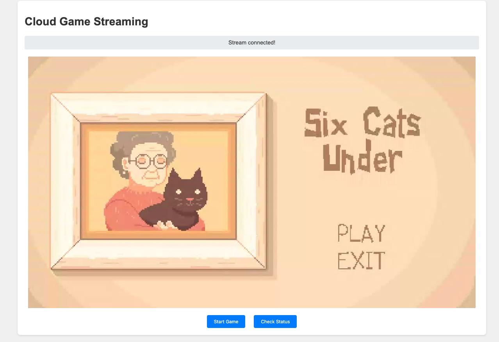

# Cloud Game Streaming Server

A Python-based cloud gaming server that enables browser-based game streaming with real-time input handling.

## Features

- WebRTC-based video streaming
- Real-time keyboard and mouse input handling
- Virtual display management
- Multi-session support
- Web-based client interface

## Requirements

- Python 3.7+
- X11 server
- Virtual framebuffer (Xvfb)
- OpenCV
- FFmpeg
- WebRTC dependencies

## Installation

1. Install system dependencies:
```bash
apt-get update
apt-get install -y python3-pip xvfb x11-utils python3-opencv ffmpeg
```

2. Install Python dependencies:
```bash
pip3 install -r requirements.txt
```

## Configuration

Key configuration settings in `server.py`:
- `GAME_WINDOW_WIDTH`: 1920
- `GAME_WINDOW_HEIGHT`: 1080
- `STREAM_WIDTH`: 1280
- `STREAM_HEIGHT`: 720
- `MAX_SESSIONS`: 10

## Usage

1. Start the server:
```bash
python3 server.py
```

2. Access the web interface:
- Open a browser and navigate to `http://localhost:8000`
- Click "Start Game" to begin a streaming session

## API Endpoints

- `GET /`: Web interface
- `POST /session`: Create new game session
- `GET /status`: Server status
- `WS /ws/{session_id}`: WebSocket endpoint for game streaming

## end result



## License

MIT License
